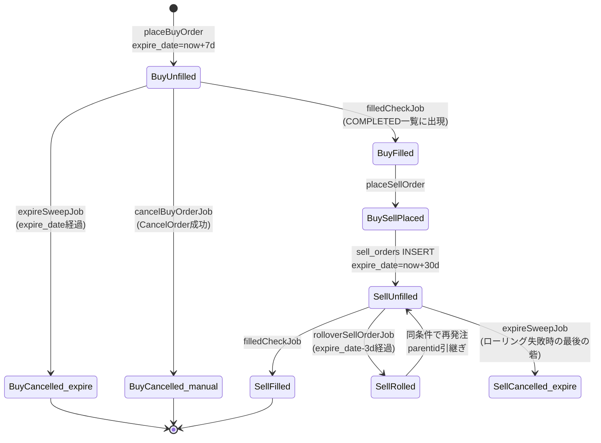

# デザインドック: 注文ライフサイクル基盤の再構築（order-lifecycle-overhaul）

> 本ドキュメントは**確定仕様**である。未決事項・選択肢は残っていない。記載された値・方式をそのまま実装すること。

## 1. 背景・目的

### 解決する技術的課題

現行実装は「注文の状態は取引所が持ち、DB は写しである」という前提が崩れている。具体的には:

1. **失効（EXPIRE）が観測できない。** Bitflyer は失効した注文を `getchildorders` から完全に削除する（実測: `child_order_state=EXPIRED` は0件、`child_order_acceptance_id` 個別指定でも0件、state 未指定で2000件遡っても発見不可）。したがって「取引所に問い合わせて失効を知る」設計は原理的に成立しない。**DB 側が有効期限を持ち、時間経過で自分から失効を判定する**必要がある。
2. **キャンセルの成否が判定できない。** `CancelOrder()` は HTTP 通信エラーのみを返し、Bitflyer が返すエラー JSON（`{"status":-XXX,"error_message":"..."}`）を検証していない。キャンセル→再発注のような複合操作を安全に組めない。
3. **注文一覧が100件で頭打ち。** `getchildorders` の `count` を指定していないため既定の100件しか取れない。未約定注文が100件を超えた状態では約定チェック・同期が破綻する。
4. **メタデータが欠落している。** `CheckFilledBuyOrders()` は SELECT した `strategy` を構造体に代入しておらず、`SyncBuyOrders()` は `strategy` を INSERT していない。結果として戦略別の評価も、戦略別の利確幅制御も不可能になっている。
5. **売り注文は30日で必ず失効する。** Bitflyer の `minute_to_expire` 上限は43200分（30日）。無期限注文は作れない。長期保有を前提とした +1.5% 利確戦略と、30日上限が構造的に矛盾している。

本設計では (1) を「有効期限の DB 保持 + 定期 sweep」、(5) を「27日ローリング」で解決し、(2)(3)(4) をその前提条件として先に整える。

### 前提となる実測エビデンス

本作業でも read-only の `GET /v1/me/getchildorders?child_order_state=ACTIVE&count=3&product_code=BTC_JPY` を実行し、以下を確認した（残高・APIキー等は記録していない）:

```
child_order_state: ACTIVE, side: BUY, child_order_type: LIMIT,
child_order_date: 2026-09-05T22:41:05, expire_date: 2026-10-05T22:41:05,
product_code: BTC_JPY, outstanding_size: 0.001
```

- `expire_date` / `child_order_date` はいずれも **`2006-01-02T15:04:05` 形式・タイムゾーンサフィックスなし（UTC）・秒精度**。
- ACTIVE な注文が現に存在し、`expire_date` が API から取得可能であることを確認した。

---

## 2. アーキテクチャ概要

### 2.1 パッケージ別の変更対象

| パッケージ / ファイル | 変更内容 | スプリント |
|---|---|---|
| `go/bitflyer/bitflyer.go` | `CancelOrder()` のレスポンス検証、`GetChildOrders()`（`count` / `before` / 個別ID対応）、`GetActiveBuyOrders` の改名、HTTP ステータスを返す内部メソッド追加 | 1 |
| `db/crypto-trading-db/atlas/schema.hcl` | `expire_date` 追加 / インデックス追加 / `strategy` の `int` 化（MySQL 用） | 2 |
| `db/crypto-trading-db-postgres/init/001_init.sql` | 同上（ローカル/テスト用の初期化 SQL） | 2 |
| `db/crypto-trading-db-postgres/migrations/`（新規） | 本番 PostgreSQL 向け DDL | 2 |
| `go/models/events.go` | `OrderEvent.ExpireDate` 追加、`BuyOrder()` / `SellOrder()` の拡張、`CheckFilledBuyOrders()` の代入漏れ修正、`SyncBuyOrders()` の戦略値付与、`CalculateMinuteToExpire()` / `CalculateSellOrderPrice()` 改修、スロット判定の仕様変更 | 2,5,6 |
| `go/models/orderLifecycle.go`（新規） | 失効 sweep / ローリング / リコンサイル用のクエリ群、remarks トークン定数 | 3,4,7 |
| `go/enums/strategy.go` | `StrategyLTP97` / `StrategyLtpLowestIn7days7t3` / `StrategyManual` / `StrategySaturatedUnknown` の追加、戦略分類ヘルパー | 2,5 |
| `go/utils/calcUtils.go` | `CalculateBuyPrice()` に新戦略の分岐追加 | 5 |
| `go/utils/util.go` | `ParseBitflyerTime()` 追加、`BfCancelCriteria` の参照停止 | 2,3 |
| `go/config/config.go`, `go/config.ini` | 設定キー追加・値変更（§4.4） | 1〜7 |
| `go/app/bitflyerApp/placeBuyOrder.go` | `expire_date` 記録、スロット判定の呼び出し変更 | 2,5 |
| `go/app/bitflyerApp/placeSellOrder.go` | `expire_date` / `remarks` 記録、`break` → `continue` 化 | 2 |
| `go/app/bitflyerApp/syncBuyOrders.go` | `expire_date` の同期・補正、500件取得 | 2 |
| `go/app/bitflyerApp/filledCheckJob.go` | 500件取得、`go vet` 指摘の解消 | 3 |
| `go/app/bitflyerApp/expireSweepJob.go`（新規） | 失効検出ジョブ | 3 |
| `go/app/bitflyerApp/rolloverSellOrderJob.go`（新規） | 売り注文の27日ローリング | 4 |
| `go/app/bitflyerApp/reconcileJob.go`（新規） | 日次リコンサイル＆アラート | 7 |
| `go/app/bitflyerApp/service.go` | 新ジョブのスケジュール登録、戦略の曜日割当変更、`cancelBuyOrderJob` の判定基準変更 | 3,4,5,7 |

**開発ルール準拠**: 新規ジョブはすべて `go/app/bitflyerApp/` 配下に1ジョブ＝1ファイルで追加する（`go/CLAUDE.md`）。エラーは必ず `slackClient.PostMessage()` で通知し、OrderID・ParentID・ProductCode・Price・Size・Strategy をコンテキストとして含める。

### 2.2 注文ライフサイクルの全体像



### 2.3 日次ジョブの実行順序（JST）

順序に意味がある。**ローリング → 失効 sweep → リコンサイル → 買い注文**の順に並べ、買い注文の発注判定時点でスロットのカウントが正しい状態にする。

| 時刻(JST) | ジョブ | 目的 |
|---|---|---|
| 05:30 | `rolloverSellOrderJob`（`trigger_time_05`） | 期限が近い売り注文を巻き直す。失敗分にはマーカーを付ける |
| 06:00 / 18:00 | `savePriceHistoryJob`（`trigger_time_04` / `trigger_time_03`・変更なし） | 価格記録 |
| 06:05 | `expireSweepJob`（`trigger_time_06`） | 幽霊レコードを `CANCELLED` に落としスロットを解放 |
| 06:15 | `reconcileJob`（`trigger_time_07`） | 取引所と DB の乖離・発注ゼロを検知して通知 |
| 06:30 | 買い注文ジョブ群（`trigger_time_01`） | 発注 |
| 06:45 | `sendResultsJob`（`trigger_time_02`） | 日次損益レポート |
| 22:45 | `cancelBuyOrderJob`（`trigger_time_08`） | 長期未約定の買い注文をキャンセル（S3 で 23:45 から移動。移動時は EC2 稼働窓外という誤った前提に基づいていたが、実環境は Pi の24時間稼働で 23:45 でも発火していた。22:45 でも Pi 停止時間帯を避けており支障はないため据え置く）。実効範囲は §4.4.1 を参照 |
| 01:20 | `gracefulShutdown`（`trigger_time_09`） | Pi 停止(01:30 JST)の10分前に新規ジョブをブロックし、実行中ジョブの完了を待って終了 |

**実行環境は Raspberry Pi 上の systemd サービス（`bfTradingApp.service` / `Restart=always`）で、原則24時間稼働する。**

- **Pi は毎日 01:30 JST に停止し、02:45 JST に起動する**（ユーザー運用）。この時間帯にジョブを配置してはならない
- アプリ内の `gracefulShutdown`(`trigger_time_09`=01:20 JST) は **Pi 停止の10分前に新規ジョブの実行をブロックするための意図した設計**であり、実行中ジョブを安全に終わらせる役割を持つ
- `terraform/modules/scheduler/event_bridge.tf` の EC2 起動・停止スケジュールは **RDS(MySQL) 時代のインフラの名残であり、現在のアプリ実行環境とは無関係**

上記のとおり、全ジョブが 01:20〜02:45 JST を避けて配置されている。

---

## 3. データモデル & ストレージ

### 3.1 重要な前提: 本番は PostgreSQL(Supabase)

- `go/private_config.ini` の `[database] driver = postgres`、`go/database/postgres_client.go`、`scripts/migration/import_to_supabase.sh` より、**本番稼働先は Supabase の PostgreSQL**（PgBouncer トランザクションプーリング経由、`default_query_exec_mode=simple_protocol`）。
- 一方 `db/crypto-trading-db/atlas/schema.hcl` と `db/Makefile` の Atlas マイグレーションは **MySQL(RDS) 向け**（`--dev-url "docker://mysql/8/dev"` 固定）。**本番には効かない。**
- **【2026-09-06 更新】PostgreSQL 側のマイグレーション機構を新設し、本番 Supabase へ適用済み。** `db/crypto-trading-db-postgres/migrations/` に `20260506000000_baseline_postgres.sql`（ベースライン。`--baseline` 指定で記録のみ・実行されない）と `20260906000000_add_expire_date.sql` を配置し、`atlas.sum` も生成済み。`db/Makefile` に `pg-remote-status` / `pg-remote-dry-run` / `pg-remote-apply` を追加（接続情報は gitignore 済みの `db/envs/.pg.env`、**5432 の session pooler 経由**）。本番は `Current Version: 20260906000000` / `Pending: 0` で適用完了済み。**スプリント2 で新たにマイグレーションを作る必要はない。**
- `docker-compose.yml` は `db/crypto-trading-db-postgres/init` を `docker-entrypoint-initdb.d` にマウントしており、**`make test` のテスト DB はこの init SQL から作られる**。つまり init SQL を更新しないと統合テストが新カラムを認識できない。

→ **スキーマ変更は3箇所に反映する**（§3.3〜§3.5）。適用の実行はすべてユーザーが行う。

### 3.2 変更サマリ

| テーブル | 変更 | 本番(PG)での必要性 | 理由 |
|---|---|---|---|
| `buy_orders` | `expire_date` カラム追加（timestamp / NULL 許容 / デフォルトなし） | **必須** | 失効判定の主キーとなる情報。既存行は NULL のため方式B（補助判定）でカバー |
| `sell_orders` | `expire_date` カラム追加（timestamp / NULL 許容 / デフォルトなし） | **必須** | ローリング対象の抽出条件に使う |
| `buy_orders` | インデックス `idx_buy_orders_status_expire (status, expire_date)` 追加 | **必須** | sweep のクエリ用 |
| `sell_orders` | インデックス `idx_sell_orders_status_expire (status, expire_date)` 追加 | **必須** | ローリング／sweep のクエリ用 |
| `buy_orders` | `strategy` の型拡張（MySQL: `tinyint` → `int` / PostgreSQL: `smallint` → `integer`） | **任意**（§3.2.1） | MySQL 用スキーマ定義の是正と、将来の桁の余裕確保 |
| `sell_orders.remarks` | **変更なし** | — | MySQL `TEXT` = 65,535バイト、PostgreSQL `TEXT` = 実質無制限。追記する文言は1回あたり60バイト程度で、ローリング1回につき旧レコードに1回追記するのみ（新レコードは別行）。単一行に累積しないため十分 |
| `price_histories` | **変更なし** | — | 記録頻度の変更のみでスキーマは不変 |

`expire_date` を NULL 許容にする理由: 既存行に埋める正しい値が存在しない（API から失効注文の期限は取れない）ため。NULL は「期限不明」を意味し、方式B（一覧からの消滅）で判定する。

#### 3.2.1 `strategy` の型変更の位置づけ（重要 / 誤解しやすい点）

**本番 PostgreSQL(Supabase) では `buy_orders.strategy` は既に `smallint`（上限 32767）であり、戦略値 10001〜20003 は問題なく格納できる。**（本番 DB を照会して確認済み）

- 127 への飽和は **MySQL(RDS) 時代の `tinyint` に起因する過去の事象**であり、Supabase 移行後は**既に解消されている**。
- したがって `ALTER TABLE buy_orders ALTER COLUMN strategy TYPE INTEGER;` は**将来の余裕を持たせるための任意の変更**であり、**これを適用しなくても本機能はすべて正しく動作する**。
- 一方 `schema.hcl`（MySQL 用）の `tinyint → int` は、**MySQL に戻した場合に同じ飽和を再発させないための対応**として必ず反映する。
- 実装コード側は型変更の有無に依存しない（Go 側は一貫して `int` で扱う）。

### 3.3 `db/crypto-trading-db/atlas/schema.hcl` の変更差分（MySQL 用）

`table "buy_orders"` に対して:

```hcl
  # 変更: tinyint -> int
  # 目的: MySQL に戻した場合に戦略値 10001-20003 が 127 に飽和するのを防ぐ。
  #       本番 PostgreSQL は既に smallint のため飽和は発生しない（§3.2.1 参照）。
  column "strategy" {
    type = int
    null = false
    default = 99
    comment = "99:not recorded / 127:旧MySQL tinyint飽和により判別不能 / 10001-10004:LTP系 / 20001-20003:7日安値ブレンド系 / 90001:手動発注"
  }

  # 追加
  column "expire_date" {
    type = timestamp
    null = true
    comment = "注文の有効期限(UTC)。取引所APIのexpire_dateまたは発注時刻+minute_to_expire"
  }

  # 追加
  index "idx_buy_orders_status_expire" {
    columns = [column.status, column.expire_date]
  }
```

`table "sell_orders"` に対して:

```hcl
  # 追加
  column "expire_date" {
    type = timestamp
    null = true
    comment = "注文の有効期限(UTC)。ローリング対象の判定に使用"
  }

  # 追加
  index "idx_sell_orders_status_expire" {
    columns = [column.status, column.expire_date]
  }
```

> **ユーザーへの依頼**: `schema.hcl` を上記のとおり更新し、`make atlas-diff n=<timestamp>_add_expire_date_and_widen_strategy` で生成されるマイグレーション SQL を確認・承認してください。`make atlas-apply` の実行タイミングはご判断ください。なお **この Atlas マイグレーションは MySQL(RDS) 向けであり、本番の Supabase には効きません**。本番には §3.4 の DDL を別途適用してください。

### 3.4 本番 PostgreSQL(Supabase) への DDL

配置先: `db/crypto-trading-db-postgres/migrations/20260906000000_add_expire_date.sql`（ディレクトリ新規作成。`make pg-apply` が参照するパスと一致する）。**エージェントは適用を実行しない。**

```sql
BEGIN;

-- ▼ 必須: 失効検出とローリングに不可欠
ALTER TABLE buy_orders  ADD COLUMN IF NOT EXISTS expire_date TIMESTAMP NULL;
ALTER TABLE sell_orders ADD COLUMN IF NOT EXISTS expire_date TIMESTAMP NULL;

CREATE INDEX IF NOT EXISTS idx_buy_orders_status_expire  ON buy_orders  (status, expire_date);
CREATE INDEX IF NOT EXISTS idx_sell_orders_status_expire ON sell_orders (status, expire_date);

COMMENT ON COLUMN buy_orders.expire_date  IS '注文の有効期限(UTC)';
COMMENT ON COLUMN sell_orders.expire_date IS '注文の有効期限(UTC)';

-- ▼ 任意: 適用しなくても本機能はすべて正しく動作する。
--   本番の strategy は既に smallint(上限32767)で、戦略値 10001-20003 は格納可能。
--   127への飽和はMySQL(tinyint)時代の過去の事象であり既に解消済み。
--   将来の桁の余裕を確保したい場合にのみ実行する。
-- ALTER TABLE buy_orders ALTER COLUMN strategy TYPE INTEGER;

COMMENT ON COLUMN buy_orders.strategy IS
  '99:not recorded / 127:旧MySQL tinyint飽和により判別不能 / 10001-10004:LTP系 / 20001-20003:7日安値ブレンド系 / 90001:手動発注';

COMMIT;
```

**適用順序**: DDL を先に適用し、その後で新バイナリをデプロイする。`ADD COLUMN` は旧コードと互換なので DDL 先行で問題ない。

### 3.5 `db/crypto-trading-db-postgres/init/001_init.sql` の変更

ローカル／CI のテスト DB を新規作成した際に本番と同じ形になるよう、`CREATE TABLE` 定義自体を更新する:

- `buy_orders`: `expire_date TIMESTAMP` を追加
- `sell_orders`: `expire_date TIMESTAMP` を追加
- 末尾に §3.4 の `CREATE INDEX IF NOT EXISTS` 2本を追加
- `strategy` は **`INTEGER` に変更する**（2026-09-06 に本番 Supabase へマイグレーション `20260906000000_add_expire_date` を適用し、`smallint` → `integer` になったため。本番との差異を作らないよう揃える）
- `expire_date TIMESTAMP` を `buy_orders` / `sell_orders` に追加し、`idx_buy_orders_status_expire` / `idx_sell_orders_status_expire` も追加する（本番と同一）

既存のローカルボリュームには init SQL が再実行されないため、開発者は `make db-down` → `docker volume rm crypto-trading-golang_postgres_data` → `make db-up` でボリュームを作り直す必要がある。この手順をスプリント2の作業メモに残す。

### 3.6 過去データ（`strategy=127` / `99`）の扱い【確定】

**データの書き換えは行わない。**

- `enums.StrategySaturatedUnknown = 127` を「旧 MySQL の tinyint 飽和により判別不能」を表す値として定義する（2025-12〜2026-05 の470件）。
- `enums.StrategyUnknown = 99` を「未記録」を表す値として定義する（163件）。
- 戦略別集計はこれら2値を除外し、**戦略別評価の計測開始点をスキーマ適用日に切り直す**。
- 遡及 UPDATE は実装しない。曜日と当時の価格比からの推定復元も行わない（price_histories が当時1日2回しかなく、BTC は bitbank `Last`、ETH は bitflyer `Ltp` と参照元が異なるため、誤ラベルが将来の戦略評価を汚染するリスクが実利を上回る）。

---

## 4. インターフェース設計

### 4.1 `go/bitflyer` — API クライアント（スプリント1）

```go
const (
    // getchildorders の count 実効上限。公式ドキュメントに記載がないため実測値を定数化する。
    // 501/1000/5000/10000 を指定しても 500 件で頭打ちになることを実測で確認済み。
    MaxChildOrdersCount = 500
    // ページング時に遡る最大ページ数（無限ループ防止）
    MaxChildOrdersPages = 10
)

// GetChildOrdersParams は /v1/me/getchildorders のクエリパラメータ。
type GetChildOrdersParams struct {
    ProductCode            string // 必須
    ChildOrderState        string // "ACTIVE" / "COMPLETED" / "CANCELED" / "" (全状態)
    Count                  int    // 0 なら MaxChildOrdersCount
    Before                 int    // 0 なら未指定（ページング用: 前ページの最小 ID）
    After                  int    // 0 なら未指定
    ChildOrderAcceptanceID string // 個別照会用
}

// GetChildOrders は1ページぶん（最大 MaxChildOrdersCount 件）取得する。
func (c *APIClient) GetChildOrders(p GetChildOrdersParams) ([]Order, error)

// GetChildOrdersAll は before ページングで最大 MaxChildOrdersPages ページ遡って全件取得する。
// 返り値の2つ目は取得できた中で最も古い child_order_date（遡り限界の判定に使う。ゼロ値なら該当なし）。
func (c *APIClient) GetChildOrdersAll(productCode, state string) ([]Order, time.Time, error)

// GetChildOrderByAcceptanceID は child_order_acceptance_id で1件照会する。
//
// ⚠️ 用途は「生きている注文（ACTIVE / COMPLETED / CANCELED）の存在確認」に限定すること。
// 失効した注文は Bitflyer の API から完全に消えるため（実測確認済み）、
// nil が返っても「失効した」とは断定できない。失効判定には expire_date を使うこと。
func (c *APIClient) GetChildOrderByAcceptanceID(productCode, acceptanceID string) (*Order, error)
```

**`GetActiveBuyOrders` の廃止**: 実態は「指定 product_code / state の子注文一覧（売買方向を問わない）」であり名前が誤り。`GetChildOrders` に置換し、呼び出し元 `syncBuyOrders.go:13,19` と `filledCheckJob.go:14` を更新して旧関数は削除する。

**`CancelOrder()` のレスポンス検証**:

```go
// APIError は Bitflyer が返すエラー JSON。
type APIError struct {
    Status       int    `json:"status"`
    ErrorMessage string `json:"error_message"`
    Data         any    `json:"data"`
}

// CancelOrder は注文をキャンセルする。
// 成功: HTTP 2xx かつ ボディが空 or {"status":0}
// 失敗: HTTP 非 2xx、または status != 0 / error_message != ""
// パース不能なレスポンスは「失敗」として扱う（フェイルセーフ: 成否不明のまま再発注させない）。
func (c *APIClient) CancelOrder(order *Order) error
```

内部で HTTP ステータスコードを参照する必要があるため、`doGETPOST` を `doRequest(method, urlPath, query, data) (body []byte, statusCode int, err error)` に切り出し、既存の `doGETPOST` はその薄いラッパとして残す（既存呼び出し元への影響なし）。

### 4.2 `go/models` — データアクセス

```go
// --- events.go の変更 ---

type OrderEvent struct {
    // ...既存フィールド...
    ExpireDate *time.Time `json:"expire_date"` // UTC。nil なら未設定
    Remarks    string     `json:"remarks"`     // 空なら既定文言
}

// BuyOrder は expire_date / remarks を含めて INSERT する（既存シグネチャ据え置き）。
func (e *OrderEvent) BuyOrder() error

// SellOrder は後方互換のため既存シグネチャを維持し、内部で SellOrderWithMeta に委譲する。
// 既存の呼び出し（go/tests/integration_test.go:103）を壊さないための措置。
func (e *OrderEvent) SellOrder(pid string) error

// SellOrderWithMeta は remarks / expire_date を明示して sell_orders に INSERT する。
func (e *OrderEvent) SellOrderWithMeta(pid, remarks string, expireDate *time.Time) error

// BuyOrderInfo.Strategy を float64 -> int に変更し、SELECT した strategy を確実に代入する
// （現在の代入漏れバグの修正）。
type BuyOrderInfo struct {
    OrderID     string
    Price       float64
    ProductCode string
    Size        float64
    Exchange    string
    Strategy    int // ← float64 から変更。代入漏れを修正
}

// CalculateSellOrderPrice は戦略別の利確率を適用する（スプリント6）。
func (b *BuyOrderInfo) CalculateSellOrderPrice() float64

// CalculateMinuteToExpire の既定値を config から取得する（スプリント5）。
func CalculateMinuteToExpire(strategy int) int
```

**スロット判定の仕様変更（スプリント5）** — buy 側はブロック、sell 側は警告のみ:

```go
// BuyOrderSlotStatus はスロットの充足状況。
type BuyOrderSlotStatus struct {
    UnfilledBuyCount  int
    UnfilledSellCount int
    MaxBuyOrders      int
    MaxSellOrders     int
    ShouldSkip        bool   // buy 側が上限に達している場合のみ true（発注をブロックする）
    SellWarning       bool   // sell 側が上限に達している場合 true（発注はブロックしない）
    Message           string // "未約定buy:n/max 未約定sell:m/max" 形式
}

// GetBuyOrderSlotStatus はスロット状況を返す。placeBuyOrder / reconcileJob が使う。
//
// 【仕様】
//   - buy 側の上限超過 → ShouldSkip=true。発注をブロックする（JPY 拘束の歯止め）
//   - sell 側の上限超過 → SellWarning=true。ShouldSkip には影響しない。
//     Slack に警告を出したうえで発注は続行する
//   - 現物の積み上がりに対する最終的な歯止めは budget_criteria（JPY 残高の下限）であり、
//     その値の管理はユーザー責務。本実装で budget_criteria の値を変更してはならない。
func GetBuyOrderSlotStatus(maxBuy, maxSell int) (*BuyOrderSlotStatus, error)

// ShouldPlaceBuyOrder は後方互換ラッパ。
// 既存テスト go/tests/integration_test.go:158 TestShouldPlaceBuyOrder を壊さないため
// シグネチャ (bool, error, string) を維持する。内部で GetBuyOrderSlotStatus に委譲し、
// 第1返り値には ShouldSkip（= buy 側の超過のみ）を返す。
func ShouldPlaceBuyOrder(maxBuy, maxSell int) (bool, error, string)
```

`placeBuyOrder` は `GetBuyOrderSlotStatus()` を使い、`SellWarning` が true なら `slackClient.PostMessage("🚨【buyingJob】売り注文が上限超過: ...", true)` を出したうえで**発注処理を続行**する。`ShouldSkip` が true の場合のみ従来どおり return する。

```go
// --- go/models/orderLifecycle.go（新規） ---

// remarks に埋め込む機械可読トークン。日本語散文でのマッチは壊れやすいため使用しない。
const (
    RemarkManualHold      = "[MANUAL_HOLD]"      // 手動保有へ移管済み。自動処理の対象外
    RemarkRolloverPending = "[ROLLOVER_PENDING]" // キャンセル成功・再発注失敗。sweep の対象外
)

// OrderTable は SQL 文字列連結を安全にするための限定型。
// 呼び出し側から任意文字列を渡せないようにし、SQL インジェクションの余地をなくす。
type OrderTable string

const (
    TableBuyOrders  OrderTable = "buy_orders"
    TableSellOrders OrderTable = "sell_orders"
)

// UpdateOrderExpireDate は order_id を指定して expire_date を上書きする（API 値による補正）。
func UpdateOrderExpireDate(table OrderTable, orderID string, expireDate time.Time) error

// GetExpiredUnfilledOrders は expire_date が (now - grace) を過ぎた UNFILLED レコードを返す。
// RemarkRolloverPending は除外しない。ローリングの窓（expire_date > now）とこのクエリの窓
// （expire_date < now - grace）は排他であり、除外すると「キャンセル成功・再発注失敗のまま
// 期限を過ぎたレコード」がどのジョブにも拾われず恒久的に滞留するため。
func GetExpiredUnfilledOrders(table OrderTable, now time.Time, grace time.Duration, limit int) ([]OrderRecord, error)

// GetUnfilledOrdersWithoutExpireDate は expire_date が NULL の UNFILLED レコードを返す（方式B用）。
// rolloverRetryAfter は「ローリングがまだ再試行しうる」timestamp の下限（= now - (fallbackDays + daysBefore) 日）。
// RemarkRolloverPending 付きレコードはこの境界より新しい間だけ除外し、
// 境界より古くなれば除外を解いて sweep の担当に移す（恒久滞留の防止）。
func GetUnfilledOrdersWithoutExpireDate(table OrderTable, productCode string, rolloverRetryAfter time.Time, limit int) ([]OrderRecord, error)

// MarkOrderCancelledWithRemark は status を CANCELLED にし、remarks に追記する。
func MarkOrderCancelledWithRemark(table OrderTable, orderID, remark string) error

// AppendOrderRemark は remarks に追記のみを行う（status は変えない）。
// ローリング再試行マーカーの付与に使う。同じマーカーが既に含まれる場合は追記しない。
func AppendOrderRemark(table OrderTable, orderID, remark string) error

// GetSellOrdersToRollover はローリング対象の売り注文を返す。
//   - expire_date IS NOT NULL AND expire_date < now + daysBefore
//   - OR expire_date IS NULL AND timestamp < now - fallbackDays
// status = 'UNFILLED' かつ order_id <> '' が前提条件。
// → status='CANCELLED' の手動保有65件は構造的に対象外になる。
func GetSellOrdersToRollover(now time.Time, daysBefore, fallbackDays, limit int) ([]SellOrderRecord, error)

// RolloverSellOrder は「旧レコードの CANCELLED 化 + 新レコードの INSERT」を単一トランザクションで実行する。
// 途中失敗時は両方ロールバックされ、DB は旧レコードが UNFILLED のまま残る（次回ジョブでリトライされる）。
func RolloverSellOrder(old SellOrderRecord, newOrderID string, newPrice float64, newExpire time.Time) error

// GetUnfilledOrderIDs は突合用に UNFILLED の order_id 一覧を返す。
// limit は全件取得を避けるための安全弁（他の models 関数と同じ流儀）。
// 上限に達した場合は truncated=true を返す。打ち切りは突合の前提が崩れている状態なので、
// reconcileJob は Slack へ通知する（ローカルログだけでは無言の停止に気づけない。F28）。
func GetUnfilledOrderIDs(table OrderTable, productCode string, limit int) (orderIDs []string, truncated bool, err error)

// OrderIDExists は指定した order_id のレコードがテーブルに存在するかを返す（status は問わない）。
// 取引所にはあるが DB に紐づかない注文（オーファン注文）の判定に使う。
func OrderIDExists(table OrderTable, orderID string) (bool, error)

// GetUnfilledOrdersWithRemark は remarks に指定文言を含む UNFILLED レコードを返す。
// [ROLLOVER_PENDING] が解消されず残っているレコード（裸の保有に近づいている状態）の検知に使う。
func GetUnfilledOrdersWithRemark(table OrderTable, remark string, limit int) ([]OrderRecord, error)

// GetRecentBuyOrders は買い注文を新しい順に limit 件返す。
// 発注ゼロ検知はこの結果を enums.IsBotStrategy() でフィルタして行う
// （SQL 側に戦略値のリストを二重に持たせないため。同じ走査から
//   「最終ボット発注時刻」「直近24hのボット発注件数」「直近24hの手動取り込み件数」を求める）。
func GetRecentBuyOrders(limit int) ([]RecentBuyOrder, error)

// ExpectedHolding は product_code ごとの想定保有量の内訳。
//   Bot   : status='UNFILLED' の sell_orders の size 合計
//           + status='FILLED'(売り未発注) の buy_orders の size 合計
//   Naked : status='FILLED(SELL ORDER PLACED)' だが生存する売り注文が無い分（裸の保有）
//   Manual: remarks LIKE '%[MANUAL_HOLD]%' の buy_orders の size 合計
type ExpectedHolding struct{ Bot, Naked, Manual float64 }

// Total は Bot + Naked + Manual。表示・調査用の参考値であり、乖離判定に使ってはならない。
func (h ExpectedHolding) Total() float64

// AlertTarget は乖離判定に使う想定保有量（Bot + Naked）を返す。
// Manual は判定から完全に除外する。ユーザーが任意のタイミングで手動売却するため、
// 判定に含めると売却された瞬間から「不足」側の乖離が恒久的に残り、毎日アラートが鳴り続けるため。
func (h ExpectedHolding) AlertTarget() float64

// GetExpectedHoldings は DB 上の想定保有量を product_code ごとに返す。
// Bot / Naked の集計は remarks LIKE '%[MANUAL_HOLD]%' を除外し、二重計上を防ぐ。
func GetExpectedHoldings() (map[string]ExpectedHolding, error)
```

**残高の乖離判定の式（確定仕様）**:

```
判定用想定保有量 = Bot + Naked + untracked_holding_{btc,eth}   ← Manual は含めない
差分             = 取引所残高(Amount) - 判定用想定保有量
不足（差分 < -閾値） → 🚨 エラー通知（ボットが売るべき現物が足りない＝売り注文が失敗しうる）
余剰（差分 > +閾値） → 日次サマリに数値を載せるのみ（取引の安全性を損なわないため通知しない）
                        ラベルは `余剰(手動保有・未追跡分を含む。アラート対象外)`。手動保有を判定から除外している以上、
                        余剰の主因は手動保有であり「DB未追跡分」だけではない（F17）
```

`Manual` を判定に含めないのは、ユーザーが手動保有を売却した時点で「実残高 < 想定保有量」となり、
**恒久的に不足アラートが鳴り続ける**ためである。手動保有はサマリに参考値として表示するだけにする。

すべてのクエリは既存コードの慣習に従い `database.CurrentDriver() == "postgres"` で `$1` / `?` を出し分ける。PgBouncer 対応のため `Prepare()` は使わず `Exec` / `Query` を直接呼ぶ（既存コミット `a432da5` の方針を踏襲）。`[` `]` は SQL の `LIKE` において特殊文字ではない（ワイルドカードは `%` と `_` のみ）ため、`LIKE '%[MANUAL_HOLD]%'` はエスケープ不要でそのまま機能する。

### 4.3 `go/enums` / `go/utils`

```go
// --- go/enums/strategy.go ---
const (
    StrategyLTP99 = 10001 // -1%（毎日）
    StrategyLTP98 = 10002 // -2%（火・土）
    StrategyLTP95 = 10003 // -5%（曜日割当から外すが、過去データのため定数は残す）
    StrategyLTP97 = 10004 // -3%（新規・月曜）

    StrategyLtpLowestIn7days5t5 = 20001 // ltp*0.5 + low7*0.5（水曜・据え置き）
    StrategyLtpLowestIn7days2t8 = 20002 // ltp*0.2 + low7*0.8（廃止。過去データのため定数は残す）
    StrategyLtpLowestIn7days7t3 = 20003 // ltp*0.7 + low7*0.3（新規・日曜）

    StrategyUnknown          = 99    // DB デフォルト。未記録（163件）
    StrategySaturatedUnknown = 127   // 旧 MySQL tinyint 飽和により判別不能（470件）
    StrategyManual           = 90001 // 取引所で手動発注され syncBuyOrders が取り込んだ注文
)

// IsBotStrategy はボットが発注した戦略値かを返す（発注ゼロ検知・戦略別集計で使う）。
// 99 / 127 / 90001 は false。
func IsBotStrategy(strategy int) bool
```

```go
// --- go/utils/util.go ---
// ParseBitflyerTime は Bitflyer が返す時刻文字列を UTC の time.Time にパースする。
// 対応形式: "2006-01-02T15:04:05" / "2006-01-02T15:04:05.999999" / RFC3339
// （実測では expire_date / child_order_date は秒精度・サフィックスなし = UTC）
func ParseBitflyerTime(s string) (time.Time, error)
```

`utils.BfCancelCriteria = -3` は **削除する**（レビュー指摘 F26）。当初は「削除せず残す」方針だったが、`cancelBuyOrderJob` が `config.Config.BFBuyOrderCancelDays` を使うようになった時点で実コードからの参照が 0 件になり、固定日数と設定値のどちらが有効なのか紛らわしいため撤去した。`OkexCancelCriteria`（`go/app/okextasks.go`）と `OkjCancelCriteria`（`go/app/okjTasks.go`）は使用中のため残す。

### 4.4 設定項目（`go/config.ini` + `go/config/config.go`）

すべて `MustInt` / `MustFloat64` / `MustBool` のデフォルト値付きで読み、**未設定でも既存挙動または安全側の値になる**ようにする。

`trigger_time_01` 〜 `trigger_time_09` は `config.NormalizeTriggerTime(value, default)` を通す（`01`〜`04` は F30-1 で追加。既定値は現行 `config.ini` と同一のため正常設定時の挙動は変わらない）。`carlescere/scheduler` の `At()` は解釈できない時刻文字列を渡されても `Run()` が静かに失敗するだけで、`service.go` は戻り値を見ていない。つまり**設定ミスや本番 `config.ini` の更新漏れが「そのジョブが二度と発火しない」という無言のデグレになる**ため、`scheduler.parseTime` と同じ規則（`HH` / `HH:MM` / `HH:MM:SS`、`hour<=23` `min<=59` `sec<=59`）で先に検証し、空文字・不正値は既定値へ倒したうえでログに警告を残す。

| セクション | キー | 値 | 導入 | 説明 |
|---|---|---|---|---|
| `[bitflyer]` | `max_buy_orders` | 15 → **28** | S5 | 未約定買い注文の上限。**超過時は発注をブロックする** |
| `[bitflyer]` | `max_sell_orders` | 25 → **60** | S5 | 未約定売り注文の警告閾値。**超過しても発注はブロックしない**（Slack 警告のみ） |
| `[bitflyer]` | `buy_minute_to_expire` | `10080`（7日） | S5 | 買い注文の有効期限。旧 3600（2.5日）から変更 |
| `[bitflyer]` | `sell_minute_to_expire` | `43200`（30日・Bitflyer 上限） | S2 | 売り注文の有効期限 |
| `[bitflyer]` | `child_orders_count` | `500` | S1 | `getchildorders` の1回あたり取得件数 |
| `[bitflyer]` | `buy_order_cancel_days` | `7` | S3 | `cancelBuyOrderJob` が能動キャンセルする経過日数（`buy_minute_to_expire` と整合させる）。**この値と `buy_minute_to_expire` の関係でジョブの実効範囲が変わる → §4.4.1** |
| `[bitflyer]` | `sell_rollover_days_before_expire` | `3` | S4 | 期限の何日前にローリングするか（30 − 3 = 27日） |
| `[bitflyer]` | `sell_rollover_fallback_days` | `27` | S4 | `expire_date` が NULL の旧レコードのフォールバック日数 |
| `[bitflyer]` | `sell_rollover_max_per_run` | `20` | S4 | 1回のジョブで処理する上限件数（レート制限とリスクの上限） |
| `[bitflyer]` | `expire_sweep_grace_minutes` | `10` | S3 | 期限経過とみなすまでの猶予（時計ずれ吸収） |
| `[tradeSetting]` | `trigger_time_01` | `06:30`（**変更しない**） | F30 | 買い注文ジョブ群(12本)。既定値フォールバックのみ追加 |
| `[tradeSetting]` | `trigger_time_02` | `06:45`（**変更しない**） | F30 | `sendResultsJob`。既定値フォールバックのみ追加 |
| `[tradeSetting]` | `trigger_time_03` | `18:00`（**変更しない**） | F30 | `savePriceHistoryJob`（夕）。既定値フォールバックのみ追加 |
| `[tradeSetting]` | `trigger_time_04` | `06:00`（**変更しない**） | F30 | `savePriceHistoryJob`（朝）。既定値フォールバックのみ追加 |
| `[tradeSetting]` | `trigger_time_05` | `05:30` | S4 | ローリングジョブ |
| `[tradeSetting]` | `trigger_time_06` | `06:05` | S3 | 失効 sweep ジョブ |
| `[tradeSetting]` | `trigger_time_07` | `06:15` | S7 | リコンサイルジョブ |
| `[tradeSetting]` | `trigger_time_08` | `22:45` | F14 | `cancelBuyOrderJob`（旧: `service.go` にハードコード） |
| `[tradeSetting]` | `trigger_time_09` | `01:20` | F14 | `gracefulShutdown`（旧: `service.go` にハードコード） |
| `[app]` | `no_order_alert_days` | `3` | S7 | 何日発注が無ければアラートするか |
| `[app]` | `balance_diff_threshold_btc` | `0.0005` | S7 | 残高乖離の通知閾値 |
| `[app]` | `balance_diff_threshold_eth` | `0.005` | S7 | 同上 |
| `[app]` | `untracked_holding_btc` | `0` | S7 | DB が追跡していない既知の BTC 保有量（過去の手動取引由来）。残高突合の**判定用想定保有量に加算するベースライン**。実値はユーザーが環境側で設定する（残高の実数値をリポジトリに残さないため既定 0） |
| `[app]` | `untracked_holding_eth` | `0` | S7 | 同上（ETH） |
| `[app]` | `budget_criteria` | **変更しない**（現行値のまま） | — | JPY 残高の下限。**ユーザーが環境側で管理する。実装で値を変更してはならない** |

`private_config.ini` への追加は**なし**。手動保有マーカーは設定ではなく Go の定数 `models.RemarkManualHold` として持つ（§4.2）。

`trigger_time_01` 〜 `trigger_time_04` の**時刻そのものは変更しない**（買い注文 06:30 / 日次レポート 06:45 / 価格履歴は 06:00・18:00 の1日2回のまま据え置き）。F30-1 で追加したのは `NormalizeTriggerTime()` による既定値フォールバックだけで、既定値は現行値と同一のため正常設定時の挙動は一切変わらない。

この4キーは既定値を持たず素の `.String()` で読まれていたため、**キーが無い・値が壊れていると空文字が入り、警告もエラーも出ないまま該当ジョブが二度と発火しない**状態になり得た。特に `trigger_time_01` は買い注文ジョブ12本を巻き添えにし、発注が完全に停止する。デプロイ時に Pi 上の `config.ini` を編集する運用があるため、編集ミスがこの形で無言化しないよう `05`〜`09` と同じ流儀に揃えた。

#### 4.4.1 `buy_order_cancel_days` と `buy_minute_to_expire` の関係（F5・確定方針）

`placeBuyOrder` は `expire_date = timestamp + buy_minute_to_expire` を記録する。`cancelBuyOrderJob` の判定順は

1. `expire_date <= now` → **skip**（取引所側では失効済みでキャンセル API が成功しない。DB の後始末は `expireSweepJob` の担当）
2. `timestamp <= now - buy_order_cancel_days` → **cancel**

であるため、`buy_order_cancel_days * 1440 >= buy_minute_to_expire` の設定では **2 を満たすレコードが必ず 1 に吸収される**。この状態では能動キャンセルは `expire_date` が NULL の旧レコードにしか効かない。

出荷設定（`buy_minute_to_expire=10080`（7日） / `buy_order_cancel_days=7`）はまさにこの状態にあたる。**これは意図した設定として確定する**（レビュー指摘 F5 の提案 (b) を採用）。

**採用理由:**

- 買い注文の期限を 2.5日 → 7日 に延ばしたのは**約定率を上げるため**（S5）。7日より手前で能動キャンセルすると、その狙いを直接削いでしまう。設定値を短くする案 (a) は、レビュー指摘の解消と引き換えに S5 の意思決定を巻き戻すことになる。
- 期限切れによるスロット解放は `expireSweepJob`（06:05 JST）が翌朝に担保しており、**能動キャンセルが発火しなくてもスロットは滞留しない**。買い注文ジョブ（06:30 JST）より前に走るため、発注判定時のスロット数も正しい。
- したがって現行設定における `cancelBuyOrderJob` の役割は「期限切れの後始末」ではなく、**① `expire_date` が NULL の旧レコードの掃除**、**② 将来 `buy_order_cancel_days` を短くチューニングしたときの早期スロット解放**の2つである。

**誤設定を検知する仕掛け:**

設定値の関係を取り違えるとジョブが黙って無効化されるため、`cancelBuyOrderJob` は実行のたびに `cancelBuyOrderConfigNote(cancelDays, buyMinuteToExpire)`（純粋関数）で整合を点検し、どちらのモードで動いているかを実効値つきでログに出力する。

- `buy_order_cancel_days * 1440 < buy_minute_to_expire` → `能動キャンセル有効: ...`
- それ以外 → `能動キャンセルは expire_date が NULL の旧レコードのみ対象: ...`（早期解放したい場合の対処も文言に含める）

出荷設定では後者が常態であり異常ではないため、**Slack 通知はせずログのみ**とする（毎日の定常ノイズを増やさない）。

### 4.5 remarks に記録する文言（定数化）

| 定数 | 文言 | 用途 |
|---|---|---|
| （既存・据え置き） | `placed by trading app` | ボット発注の買い注文 |
| （既存・据え置き） | `placed manually` | `syncBuyOrders` が取り込んだ手動注文 |
| `RemarkManualHold` | `[MANUAL_HOLD]` | 手動保有へ移管済み（130レコード）。リコンサイルの乖離アラート対象外にする。**付与は前提条件として完了済み** |
| `RemarkRolloverPending` | `[ROLLOVER_PENDING]` | キャンセル成功・再発注失敗のマーカー。sweep はこのマーカーを持つレコードを除外する |
| ローリング新レコード（書式） | `{旧order_id}の売り注文の再注文` | ローリングで作った新レコードの remarks |
| ローリング旧レコード（書式） | ` / rolled over to {新order_id} at {UTC時刻}` | 旧レコードへの追記 |
| sweep（書式） | ` / expired at {UTC時刻} (auto sweep, method=A\|B)` | sweep が CANCELLED にした際の追記 |

---

## 5. スケジューリングとタイムゾーン

### 5.1 タイムゾーンの原則

| 対象 | TZ | 根拠 |
|---|---|---|
| スケジューラの時刻指定（`scheduler.Every().Day().At()`） | **システム TZ（= Raspberry Pi の TZ）** | 実行環境は Pi 上の systemd サービス。Pi の停止時間帯 **01:30〜02:45 JST** を避けてジョブを配置する。`gracefulShutdown`(01:20) は Pi 停止10分前に新規ジョブをブロックする意図した設計 |
| DB に保存する `expire_date` / `timestamp` | **UTC** | 既存の `placeBuyOrder` / `SavePriceHistory` が `time.Now().In(utc)` で保存している慣習に合わせる |
| 取引所 API の `expire_date` / `child_order_date` | **UTC**（サフィックスなし表記） | 実測で確認 |
| 失効判定の比較 | **UTC 同士** | `time.Now().UTC()` と DB の `expire_date` を比較する |

新規ジョブに「JST の想定時間帯でなければスキップする」防御チェックは**入れない**（既存の買い注文ジョブも入れておらず、一貫性を優先）。代わりに、ジョブ冒頭のログに `time.Now()` と `time.Now().UTC()` の両方を出力し、TZ 誤設定を運用で検知できるようにする。

### 5.2 スケジュール登録（`service.go`）

登録はすべて `jobRegistry`（`go/app/bitflyerApp/jobRegistry.go`）経由で行う（F30-2）。

```go
registry := &jobRegistry{}

registry.daily("rolloverSellOrderJob", config.Config.TriggerTime05, rolloverSellOrderJobFunc) // 05:30
registry.daily("expireSweepJob", config.Config.TriggerTime06, expireSweepJobFunc)             // 06:05
registry.daily("reconcileJob", config.Config.TriggerTime07, reconcileJobFunc)                 // 06:15
registry.interval("syncBTCBuyOrderJob", 90, syncBTCBuyOrderJob)                               // 90秒ごと
// savePriceHistoryJob は既存のまま変更しない（trigger_time_03=18:00 / trigger_time_04=06:00 の1日2回）

registry.reportRegistrationResult() // 失敗が1件でもあれば起動時に1通Slack通知
```

- すべて `wrapJob()` でラップし、グレースフルシャットダウン中は実行されないようにする（既存の仕組みに乗る）。例外は `gracefulShutdown` 自身で、`registry.dailyWithoutWrap()` を使う。`wrapJob()` を通すと自分が `runningJobs` に加算され、自分の完了を待ち続けてしまうため。
- **Pi は毎日 01:30〜02:45 JST に停止するため、日次ジョブをこの時間帯に置いてはならない。** それ以外の時刻は24時間いつでも配置可能。

#### 5.2.1 スケジュール登録の失敗を無言にしない（F30-2）

`carlescere/scheduler` の登録は多段で無言化する。

1. `Every().Day().At(v)` は `v` が解釈できないとき `Job.err` に格納するだけで、戻り値は `*Job` のみ
2. `Run()` は `(*Job, error)` を返し `j.err` があれば `nil, err` を返すが、**従来の `service.go` は戻り値を捨てていた**
3. ゴルーチンが起動されず、そのジョブは二度と発火しない
4. ログにもSlackにも何も出ず、プロセスは正常に動き続ける

登録は20本近くあり、1本欠けても気づけない。特に買い注文ジョブ12本はすべて同じ `trigger_time_01` を使うため、**1つの設定ミスで発注が全滅する**。

そこで `jobRegistry` に `daily` / `dailyWithoutWrap` / `interval` の3ヘルパーを持たせ、**`Run()` の戻り値を必ず検査**して失敗を `jobRegistrationFailure{Name, Schedule, Err}` として集約する。集約ロジック（`record` / `hasFailures` / `total` / `failureReport`）は scheduler に触れない純粋な関数として切り出してあり、ゴルーチンを起動せずにテストできる。

**登録失敗時にプロセスは落とさない。** 起動時に1通のSlackエラー通知（失敗したジョブ名・スケジュール指定・エラー内容・「二度と発火しない」旨・対処方法）とログを出し、登録できたジョブはそのまま動かす。理由:

- 実行環境は systemd の `Restart=always` / `RestartSec=10`。設定ミスは再起動しても直らないため、落とすと**10秒間隔の再起動ループ**になり、そのたびにSlack通知が飛んで逆に埋もれる
- **部分稼働のほうが安全側**。例えば `trigger_time_02`（損益レポート）だけが壊れた場合にプロセスを落とすと、`syncBuyOrders` / `filledCheck` / `placeSellOrder` まで止まり、既に取引所に出ている買い注文が約定しても売り注文が発注されない。「レポートが来ない」より「建玉が放置される」ほうが損害が大きい
- F30-1 で `trigger_time_01`〜`09` はすべて `NormalizeTriggerTime()` を通って既定値へ倒れるため、**設定由来の `At()` 失敗はそもそも起きない**。ここに残る失敗要因は `Every(0)` やチェーン誤りといった実装バグで、ビルド・テストで捕捉すべきもの

つまりこの仕掛けの目的は「止めること」ではなく「無言をやめること」にある。気づいた人間が `config.ini` を直して再起動する運用を前提にしている。

なお `go/app/okextasks.go` / `go/app/okjTasks.go` にも同じ「`Run()` の戻り値を捨てる」パターンがあるが、こちらは時刻がすべてソース内のリテラルで設定ミスの経路が無く、bitflyer 定期売買アプリでも使っていないため**対象外とした**。

### 5.3 日跨ぎの扱い

- `expire_date` は絶対時刻なので日跨ぎの特別扱いは不要。
- ローリングの「27日」は `expire_date - 3日` で表現するため、うるう秒・DST の影響を受けない（JST に DST はない）。
- **【ユーザー決定 2026-09-06】価格履歴の記録頻度は1日2回（06:00 / 18:00 JST）のまま変更しない。** そのため `GetLowestPriceInPast7Days()` が返す「7日安値」は実際の安値より高めに出る（サンプルが14点しかない）。ブレンド戦略（水曜 5t5・日曜 7t3）の指値が想定より浅くなる既知の制約として受け入れる。日曜を 2t8→7t3 に変更して7日安値への依存度を 80%→30% に下げているため、影響は限定的。

---

## 6. エラーハンドリングと Slack 通知

### 6.1 原則

- **ジョブ全体を止めない**: 複数レコードを処理するループでは `break` を使わず `continue` する。現行 `placeSellOrder` の `break`（4箇所）も `continue` に修正する。
- **フェイルセーフの方向**: 判定不能なときは常に「発注しない／キャンセルしない／状態を変えない」側に倒す。DB から読んだ `timestamp` を解釈できなかった場合も、ゼロ値を「十分古い」と解釈せず `OrderRecord.TimestampValid=false` として呼び出し側へ伝え、`cancelBuyOrderJob` は判定を見送って件数を通知する。発注価格の参照元（bitflyer `GetTicker` / bitbank `GetBBTicker`）の取得に失敗した場合も、error を握り潰さず `validateBuyPriceSources()` で検証したうえで発注を中止する。
- **必ず通知する**: エラーは `slackClient.PostMessage(msg, true)`（エラーチャンネル）。正常サマリは `PostMessage(msg, false)`。
- **コンテキストを含める**: OrderID / ParentID / ProductCode / Side / Price / Size / Strategy / ExpireDate のうち該当するものを必ず本文に入れる（ルート `CLAUDE.md` の開発ルール）。

### 6.2 ジョブ別の通知内容

| ジョブ | 契機 | 通知先 | 本文 |
|---|---|---|---|
| `expireSweepJob` | 正常終了 | 通常 | `【expireSweep】buy:{N}件 sell:{M}件 を CANCELLED / 約定判明:{K}件 / 判定保留:{P}件` |
| `expireSweepJob` | 判定保留あり | エラー | `🚨【expireSweep】判定保留 {P}件: COMPLETED一覧の遡り限界({最古child_order_date})より古いレコード。手動確認が必要 order_ids=[{id}({product_code}/{table}/method={A|B})...]`（方式A・方式Bの双方が対象） |
| `expireSweepJob` | API / DB エラー | エラー | `🚨【expireSweep】{処理名} 失敗: {err} (product_code={pc})` |
| `rolloverSellOrderJob` | 正常終了 | 通常 | `【rolloverSellOrder】対象:{N} 巻き直し成功:{M} 約定判明:{K} 部分約定(残数量で再発注):{P} オーファン取込:{A} スキップ:{S} 失敗:{F}` |
| `rolloverSellOrderJob` | オーファン注文を検出しDBへ取り込み | エラー | `🚨【rolloverSellOrder】前回の再発注は実際には成立していました（レスポンスの取りこぼし）。二重売りを避けるため再発注せずDBへ取り込みます: OldOrderID={id} ... OrphanOrderID={new_id}` |
| `rolloverSellOrderJob` | **キャンセル成功・再発注失敗** | エラー | `🚨🚨【rolloverSellOrder】裸の保有が発生: OldOrderID={id} ParentID={pid} {product_code} price={p} size={s} err={err} → DBは変更せず次回リトライします` |
| `rolloverSellOrderJob` | キャンセル失敗 | エラー | `🚨【rolloverSellOrder】CancelOrder 失敗: OrderID={id} {product_code} price={p} size={s} err={err}` |
| `rolloverSellOrderJob` | キャンセル後に COMPLETED を検出 | 通常 | `【rolloverSellOrder】キャンセル直前に約定: OrderID={id} → FILLED に更新（再発注せず）` |
| `expireSweepJob` | ローリング失敗の末に売り注文が失効 | エラー | `🚨🚨【expireSweep】売り注文が失効しました: OrderID={id} ParentID={pid} {product_code} price={p} size={s}（[ROLLOVER_PENDING] 付き: ローリングの再発注に失敗したまま期限を過ぎました）。現物は保有されたままです。親買い注文は FILLED(SELL ORDER PLACED) のまま維持します。手動での対応をお願いします`<br>※ `[ROLLOVER_PENDING]` 付きレコードもローリングの窓を過ぎれば sweep の対象になるため、この通知は必ず発火する |
| `reconcileJob` | 乖離検出 | エラー | `🚨【reconcile】注文の乖離を検出: DBのみ UNFILLED:{N}件 / 取引所のみ ACTIVE(BUY):{M}件` ＋ 代表 order_id 10件<br>※**「取引所のみ ACTIVE / SELL」はエラー通知の対象外**（F7）。`sell_orders` は取引所から同期する仕組みが無く、ユーザーが手動保有ポジションを売却するために置いた SELL 指値と区別できないため、日次サマリへの掲載に留める。ボットの売り注文の取りこぼしは `rolloverSellOrderJob` のオーファン検出と `[ROLLOVER_PENDING]` 残留通知で検知する |
| `reconcileJob` | 取引所のみ ACTIVE / SELL | 通常（日次サマリ） | `注文突合(アラート対象外): 取引所のみ {product_code}/SELL {N}件(手動売却の可能性。アラート対象外): [order_id...]` |
| `reconcileJob` | `[ROLLOVER_PENDING]` 残留 | エラー | `🚨【reconcile】ローリング再試行待ち([ROLLOVER_PENDING])のまま残っている売り注文が {N}件あります` ＋ 明細（OrderID / ParentID / product_code / price / size）<br>※`[ROLLOVER_PENDING]` 付きレコードは取引所側に注文が無いのが当然なので必ず「DBのみ UNFILLED」としても現れる。同じ事象で2通鳴るのを避けるため、**注文突合の `DBOnly` からは除外し、この専用通知に一本化する**（F16）。除外分は日次サマリに件数と代表 order_id を載せる |
| `reconcileJob` | 発注ゼロ検知 | エラー | `🚨【reconcile】ボットの買い注文が {N}日間 0件です。最終発注: {ts}` |
| `reconcileJob` | 未約定レコード取得の打ち切り | エラー | `🚨【reconcile】未約定レコードの取得が上限({N}件)で打ち切られました: table={t} product_code={pc}。突合結果が実態とずれている可能性があります`（F28） |
| `reconcileJob` | 正常 | 通常 | `【reconcile】OK 未約定buy:{n}/{max_buy} 未約定sell:{m}/{max_sell} 残高乖離なし（手動保有 BTC:{x} ETH:{y} を除く）` |
| `placeBuyOrder` | buy 側スロット枯渇でスキップ | エラー | `🚨【buyingJob】発注スキップ: 未約定buy {n}/{max_buy}（上限到達）未約定sell {m}/{max_sell}` |
| `placeBuyOrder` | sell 側スロット超過（**発注は続行**） | エラー | `🚨【buyingJob】売り注文が上限超過: 未約定sell {m}/{max_sell}。発注は続行します。JPY残高の歯止め(budget_criteria)を確認してください`<br>※超過状態は解消まで数週間続きうる一方、買い注文ジョブは1日に最大12本走る。同一内容の警告が埋もれないよう **24時間に1回まで集約する**（`notificationThrottle`、F18）。通知は消さず、解消するまで `reconcileJob` も日次で1通通知する |
| `placeSellOrder` | 個別失敗 | エラー | 既存の本文を維持しつつ `break` → `continue`。末尾に `成功:{M}/{N}` のサマリを追加 |
| `placeSellOrder` | 約定済み買い注文の取得失敗 | エラー | `🚨【sellOrderjob】約定済み買い注文の取得に失敗したため売り注文を発注しません: {err}`<br>※`CheckFilledBuyOrders()` は「0件」と「読み取り失敗」を区別できるよう `([]BuyOrderInfo, error)` を返す。以前は失敗時も nil を返し、売り注文の発注が無言でスキップされていた（F9） |
| `syncBuyOrders` | 取り込み失敗（count / insert / expire_date） | エラー | `🚨【syncBuyOrders】注文の取り込みに失敗しました product_code:{pc} {N}件` ＋ 明細（`op` / OrderID / ProductCode / Side / Price / Size / Strategy / err）を先頭10件<br>※`models.SyncBuyOrders()` は失敗を `[]SyncBuyOrderFailure` で返し、通知は app 層で行う（F9） |
| `cancelBuyOrderJob` | `timestamp` を解釈できず判定を見送り | エラー | `🚨【cancelBuyOrderJob】timestamp を解釈できず判定を見送った買い注文が {N}件あります: order_ids=[...]。キャンセルしない側に倒しています` |

### 6.3 リトライ方針

| 事象 | リトライ |
|---|---|
| ローリングの再発注失敗 | DB を変更しないため、次回ジョブ（翌日 05:30）で自動的に再対象化される。ジョブ内での即時リトライは行わない（レート制限と重複発注のリスク） |
| キャンセル失敗 | 同上。次回ジョブで再試行 |
| API の一時的エラー（5xx / タイムアウト） | ジョブ内リトライはしない。次回スケジュールに委ねる |
| DB エラー | リトライしない。Slack 通知して当該レコードを skip |

**ローリングの猶予設計**: 期限の3日前から対象になるため、日次ジョブで最大3回の再試行機会がある。3日連続で失敗すると失効する。その場合の扱いは §7.2 のとおり「親買い注文は戻さず Slack 通知のみ」。

---

## 7. 取引安全性

### 7.1 二重売り・二重発注の防止

| 防止対象 | 仕組み |
|---|---|
| **ローリングでの二重売り** | キャンセル API 成功後に `GetChildOrderByAcceptanceID` で個別照会し、`child_order_state` を確認する。<br>・0件（消滅）→ キャンセル成立とみなし再発注する（この時点で対象は「生きていた注文」なので、消滅＝キャンセル成立と断定できる）<br>・`COMPLETED` → **再発注しない**。`UpdateFilledOrder(orderID)` で `FILLED` に更新<br>・`ACTIVE` のまま → キャンセル未成立。再発注せず Slack 通知して次のレコードへ |
| **ローリング処理前の約定** | ループ前に `GetChildOrdersAll(productCode, "COMPLETED")` を product_code ごとに1回だけ取得してマップ化し、対象 order_id が含まれていれば `FILLED` に更新して skip する（キャンセル API を叩かない） |
| **再発注レスポンスの取りこぼしによる2本目の発注** | ループ前に `GetChildOrdersAll(productCode, "ACTIVE")` も取得する。`[ROLLOVER_PENDING]` 付きレコードの再試行では、再発注の直前に ACTIVE 一覧から「同一 `product_code` / `price` / `size` / `side=SELL` かつ `sell_orders` に紐づかない注文（オーファン注文）」を探す。<br>・見つかった → **再発注しない**。その `order_id` を `RolloverSellOrder` で DB に取り込み、🚨 通知する<br>・ACTIVE 一覧が取得できなかった / DB 照合に失敗した → 判定不能なので**再発注せず**次回リトライ |
| **sweep による誤 CANCELLED** | 期限切れ候補を `CANCELLED` にする前に、必ず COMPLETED 一覧と突合する。含まれていれば `FILLED` に更新して sweep 対象から外す |
| **遡り不足による誤 CANCELLED** | 方式A・方式Bとも `decideSweepAction()` を通し、COMPLETED 一覧で遡れた最古の `child_order_date`（`oldestCompleted`）より古いレコードは `CANCELLED` にせず判定保留にして Slack 通知する。`timestamp` がゼロ値（DB値のパース失敗）や `oldestCompleted` がゼロ値の場合も保留に倒す |
| **新レコードの重複 INSERT** | `sell_orders.order_id` の UNIQUE 制約 + 既存の duplicate key ハンドリング。取引所が返した `child_order_acceptance_id` は一意 |
| **旧レコード CANCELLED と新レコード INSERT の不整合** | 単一トランザクションで実行。片方だけ成功する状態を作らない |
| **買い注文の重複** | 変更なし（既存の曜日チェック + 1日1回のスケジュール + buy 側スロット上限28） |

### 7.2 ローリングが最終的に失敗した場合の扱い【確定仕様】

3日間のリトライ機会をすべて失敗し、売り注文が失効した場合:

- `expireSweepJob` が該当の `sell_orders` レコードを `CANCELLED` にする。`[ROLLOVER_PENDING]` マーカーによる sweep の除外は「ローリングがまだ再試行しうる間」に限定されており、期限（または `expire_date` が NULL の旧レコードでは想定寿命30日）を過ぎたレコードは必ず sweep が回収する。
- **親買い注文は `FILLED(SELL ORDER PLACED)` のまま維持し、`FILLED` に戻さない。**
- **自動での売り注文の再発注は行わない。**
- Slack に上記 §6.2 の「売り注文が失効しました」通知を出し、**ユーザーが手動で対応する**。

この結果、現物は手元にあるが売り注文が存在しない状態（幽霊在庫）が残る。自動復旧を行わないのは、残高の裏取りができないまま発注するリスクを避けるためである。通知を必ず出すことで、無言で放置される状態を防ぐ。

### 7.3 手動保有130レコードの保護

3層で保護する。

1. **ローリングの抽出条件**は `sell_orders.status = 'UNFILLED'`。手動移管した65件は `CANCELLED` なので**構造的に対象外**。
2. **sweep の抽出条件**も `status = 'UNFILLED'`。同様に対象外。
3. **親買い注文**（`FILLED(SELL ORDER PLACED)`）は `CheckFilledBuyOrders()` の条件 `status = 'FILLED'` に一致しないため、`placeSellOrder` の対象にもならない。

加えて `reconcileJob` の残高突合では、`remarks LIKE '%[MANUAL_HOLD]%'` で手動保有分を識別し、**内訳として別枠表示するのみ**とし、乖離アラートの判定式（`AlertTarget() = Bot + Naked`）から完全に除外する。判定用の想定保有量に手動保有を加算してはならない。加算すると、ユーザーが手動保有を売却した時点で「実残高 < 想定保有量」となり恒久的に不足アラートが鳴り続けるため。

**注意**: 上記1〜3はすべて `status` 列に依存しているため、手動保有レコードの `status` を `UNFILLED` に戻すと自動処理の対象に復帰する。運用上の注意として明記する。

### 7.4 数量・価格・売買方向

- ローリングの再発注は **`product_code` / `price` / `size` / `side="SELL"` を旧レコードから機械的に引き継ぐ**。価格の再計算は一切行わない。
- `size` は `float64`。DB の `double precision` からそのまま渡すため丸め誤差は入らない。ただし Bitflyer の最小取引単位（BTC 0.001 / ETH 0.01）を下回る場合は発注が拒否されるため、`size < 最小単位` のレコードは処理せず Slack 通知して skip する。
- `price` は `utils.Round()` で整数円に丸める（既存の慣習）。ローリングでは旧レコードの `price` をそのまま使うため再丸めは不要。

### 7.5 レート制限

Bitflyer の Private API は「5分あたり500回」、注文系は「5分あたり300回」が目安。

- ローリング1件あたり: 個別照会1 + キャンセル1 + 発注1 = 3リクエスト。
- `sell_rollover_max_per_run = 20` → 最大60リクエスト + 事前の一覧取得（product_code × 2状態 × 最大10ページ = 40）= 約100リクエスト。安全域。
- ループ内に 500ms のスリープを入れる。
- `reconcileJob` / `expireSweepJob` の一覧取得もページング上限（10ページ）で制限。

---

## 8. 代替案とトレードオフ

| # | 検討した案 | 採用しなかった理由 |
|---|---|---|
| 1 | **`child_order_state=EXPIRED` で失効を検出する** | 実測で0件。失効注文は API から完全に消えるため原理的に不可能 |
| 2 | **失効注文を `child_order_acceptance_id` 個別指定で拾う** | 実測で0件。対照実験として ACTIVE / COMPLETED の個別指定は1件返るため、フィルタではなくデータそのものが消えている |
| 3 | **売り注文を成行 or 期限なしで出す** | Bitflyer に無期限注文は存在しない（上限30日）。成行は利確戦略そのものを壊す |
| 4 | **ローリングを「新規発注 → 旧キャンセル」の順にする** | 一時的に同じ現物に対する売り注文が2本並び、残高不足で新規発注が拒否される。あるいは両方約定して二重売りになる。**必ずキャンセルが先** |
| 5 | **ローリングを29日目に行う** | 猶予が1日しかなく、1回でも失敗すると失効する。3日前（27日目）なら日次ジョブで3回の再試行機会がある |
| 6 | **`expire_date` を持たず「一覧からの消滅」だけで失効判定する（方式Bのみ）** | COMPLETED 一覧の遡り限界（500件×10ページ）を超えた古い注文を誤って失効判定する危険がある。方式A（期限の経過）が確定的で安全。方式Bは既存 NULL レコードの救済に限定する |
| 7 | **`strategy` を varchar にして戦略名を保存する** | 既存の470+163件との互換、既存の集計 SQL、`enums` の int 定数すべてに影響する。int のまま扱うほうが変更が小さい |
| 8 | **利確率を `config.ini` に外出しする** | 戦略を追加するたびに設定キーが増え、コードと設定の二重管理になる。コード内のマップ（`map[int]float64`）+ default フォールバックのほうが凝集度が高い |
| 9 | **sell 側スロットで発注をブロックし続ける（現行仕様）** | ローリングにより売り注文は失効しなくなるため、未約定 sell は約定するまで単調増加する。ブロックを維持すると同じスロット枯渇が必ず再発する。sell 側は警告のみとし、資金面の歯止めは `budget_criteria` に一本化した |
| 10 | **sell 側スロットのチェック自体を削除する** | 現物の積み上がりを可視化する指標が失われる。閾値60を「警告ライン」として残し、毎日 Slack で見える状態にした |
| 11 | **失効した売り注文の親買い注文を `FILLED` に戻して自動再発注する** | 残高の裏取りができないまま発注するリスクがある。通知してユーザーが手動対応する方式を採用した（§7.2） |
| 12 | **`strategy=127` を推定して遡及 UPDATE する** | price_histories が当時1日2回しかなく、BTC は bitbank `Last`、ETH は bitflyer `Ltp` と参照元が異なるため精度が低い。誤ラベルが将来の戦略評価を汚染するリスクが実利を上回る |
| 13 | **`SellOrder(pid string)` のシグネチャを直接変更する** | `go/tests/integration_test.go:103` の既存呼び出しが壊れる。後方互換ラッパを残し `SellOrderWithMeta` を追加するほうが差分が小さい |
| 14 | **手動保有の判定を日本語散文（`LIKE '%手動保有へ移管%'`）で行う** | 文言のゆらぎ・表記変更で壊れる。機械可読トークン `[MANUAL_HOLD]` による判定を採用した |
| 15 | **`price_histories` の記録頻度を上げる（毎時・1分足など）** | 7日安値の精度は上がるが、ユーザー判断により1日2回のまま据え置き（2026-09-06 決定）。7日安値への依存度を下げる方向（日曜 2t8→7t3）で対処する |
| 16 | **失効 sweep を約定チェック（90秒周期）に相乗りさせる** | 90秒ごとに全 UNFILLED をスキャンするのは無駄。失効は日次で十分で、買い注文ジョブの直前に1回走れば目的（スロット解放）を達成できる |
| 17 | **Atlas に PostgreSQL 用の設定を追加して一本化する** | 本機能のスコープを超える（`atlas.hcl` / `Makefile` / dev-url の全面改修）。今回は MySQL 用 schema.hcl と PostgreSQL 用 DDL を並行管理し、一本化は別課題とする |
| 18 | **相場レジーム対応（7日移動平均による深指値停止・売り指値のトレーリング）** | バックテストの裏付けが薄く挙動変更が大きい。今回のスコープから完全に除外する（`spec.md` の「対象外」参照） |

---

## 9. 検証方法

### 9.1 コマンド

```bash
make build                      # go/bfTradingApp のビルドが通ること（全スプリント共通）
cd go && go vet ./...           # 変更したファイルに新規指摘がないこと
                                # ベースライン除外: go/okex/okex.go
                                # ※ go/bitbank/bitbank.go の指摘（using resp before checking for errors）は
                                #   Phase 3 の F6 対応で解消済み
                                # ※ go/app/bitflyerApp/filledCheckJob.go はスプリント3で変更するため
                                #   ベースライン指摘（log.Println へのフォーマット引数）を解消する
cd go && gofmt -l .             # 変更ファイルが列挙されないこと
make db-up && make test         # 既存統合テスト（go/tests/）が全件パスすること
make db-down
```

- スプリント2以降は、テスト DB に新カラムが必要。`make db-down` → `docker volume rm crypto-trading-golang_postgres_data` → `make db-up` でボリュームを作り直して init SQL を再実行する。
- `make atlas-diff n=<timestamp>_add_expire_date_and_widen_strategy` は**参照系**なので実行してよい（生成 SQL の確認まで）。`make atlas-apply` は実行しない。

### 9.2 参照系 API での確認（許可不要）

| 確認項目 | エンドポイント | 確かめること |
|---|---|---|
| `count` / `before` ページング | `GET /v1/me/getchildorders?product_code=BTC_JPY&child_order_state=COMPLETED&count=500` → 返却の最小 `id` を `before` に渡して再取得 | 2ページ目が1ページ目と重複せず、より古い注文が返ること。500件超を指定しても500件で止まること |
| 個別照会 | `GET /v1/me/getchildorders?product_code=BTC_JPY&child_order_acceptance_id={ACTIVEな注文のID}` | 1件返ること（生存確認が機能する） |
| 失効注文が消えること（再確認） | 同上に失効済み ID を指定 | 0件が返ること |
| `expire_date` の形式 | `GET /v1/me/getchildorders?product_code=ETH_JPY&child_order_state=ACTIVE&count=10` | `2006-01-02T15:04:05` 形式であること。`ParseBitflyerTime` の実装確認に使う |
| 残高突合（S7） | `GET /v1/me/getbalance` | BTC / ETH の `amount` / `available` が DB の想定保有量と整合すること |
| 現在の未約定件数 | `GET /v1/me/getchildorders?...&child_order_state=ACTIVE&count=500`（BTC / ETH） | DB の `UNFILLED` 件数と一致すること（sweep の効果測定） |

**注意**: レスポンスに含まれる残高・APIキー等は成果物ファイルやログに残さない。

### 9.3 更新系 API での確認（要ユーザー許可）

以下はローリングの中核であり、実発注なしには最終確認できない。**エージェントは実行せず、`state/current_sprint.json` の `pending_user_approval` に記載してメイン会話に判断を委ねる。**

**検証シナリオ（スプリント4完了時）:**

1. **目的**: キャンセル→再発注のシーケンスが、レスポンス検証・個別照会・DB トランザクションを含めて期待どおり動くことを確認する。
2. **エンドポイントとパラメータ案**:
   - `POST /v1/me/sendchildorder`
     `{"product_code":"ETH_JPY","child_order_type":"LIMIT","side":"SELL","price":<現在LTPの1.5倍>,"size":0.01,"minute_to_expire":10,"time_in_force":"GTC"}`
     → **約定しない極端に高い指値**、**最小取引単位 0.01 ETH**、**10分で自動失効**
   - `POST /v1/me/cancelchildorder`
     `{"product_code":"ETH_JPY","child_order_acceptance_id":"<上で得たID>"}`
   - 再度 `sendchildorder` を同条件で発行（ローリングの再発注に相当）
3. **想定される影響**: 現物 0.01 ETH が売り注文として拘束される。LTP の1.5倍という指値のため約定可能性は極めて低い。JPY の拘束は発生しない（売り注文のため）。
4. **リスクを下げる工夫**: 最小取引単位・現在価格の1.5倍・`minute_to_expire=10` で自動失効。ETH の手持ちが不足する場合は実施しない。
5. **後始末**: 発注した注文のキャンセルは**ユーザーがコンソール上で行う**。エージェントは片付けのためのキャンセル API を叩かない。

**許可が得られない場合**: `CancelOrder()` のレスポンス検証・個別照会・トランザクション順序をコード追跡で確認し、`state/evaluation_result.json` に「実機未確認」と明記する。**実機未確認であることだけを理由にスプリントを不合格にしない。**

### 9.4 コード追跡で確認する受け入れ条件

| 受け入れ条件 | 読むコード |
|---|---|
| キャンセル成否がフェイルセーフに判定される | `go/bitflyer/bitflyer.go` の `CancelOrder()` / `doRequest()`。パース不能時に `error` を返していること |
| 500 がハードコードされていない | `grep -rn "500" go/bitflyer/` で定数定義のみがヒットすること |
| sweep が COMPLETED 突合を先に行う | `go/app/bitflyerApp/expireSweepJob.go` の処理順序 |
| 方式Bの判定保留 | 同上。取得できた最古の `child_order_date` との比較ロジック |
| ローリングが `break` しない | `go/app/bitflyerApp/rolloverSellOrderJob.go` にループ脱出の `break` がないこと |
| `parentid` の引き継ぎ | `models.RolloverSellOrder()` の INSERT 文が `old.ParentID` を使っていること |
| `remarks` の文言 | 同上。`fmt.Sprintf("%sの売り注文の再注文", old.OrderID)` |
| 単一トランザクション | `models.RolloverSellOrder()` が `AppDB.Begin()` / `Commit()` / `Rollback()` を使っていること |
| 失効時に親を戻さない | `expireSweepJob.go` に `buy_orders` を `FILLED` に戻す処理が**存在しない**こと。通知のみであること |
| 手動保有130件が対象外 | `models.GetSellOrdersToRollover()` / `GetExpiredUnfilledOrders()` の WHERE 句に `status = 'UNFILLED'` があること |
| 手動保有の判定がトークン方式 | `models.RemarkManualHold = "[MANUAL_HOLD]"` が定義され、`GetExpectedHoldings()` が `LIKE '%[MANUAL_HOLD]%'` を使っていること。日本語散文でのマッチが**ない**こと |
| sell 側が発注をブロックしない | `models.GetBuyOrderSlotStatus()` の `ShouldSkip` が buy 側の判定のみで決まること。`placeBuyOrder` が `SellWarning` で return していないこと |
| `budget_criteria` を変更していない | `git diff` で `go/config.ini` の `budget_criteria` 行が変更されていないこと |
| `Strategy` の代入漏れ修正 | `go/models/events.go` `CheckFilledBuyOrders()` の `BuyOrderInfo{...}` リテラルに `Strategy: strategy` があること |
| `SyncBuyOrders` の戦略値 | INSERT 文のカラムリストに `strategy` があり、`enums.StrategyManual` が渡されていること |
| 過去データを書き換えていない | `git diff` に `UPDATE buy_orders SET strategy` を含む SQL が**存在しない**こと |
| 利確率のフォールバック | `CalculateSellOrderPrice()` の default が `1.015` であること |
| 期限が config から読まれる | `models.CalculateMinuteToExpire()` が `config.Config.BFBuyMinuteToExpire` を参照すること |
| レジーム対応が実装されていない | `grep -rniE "regime|trailing|移動平均|MovingAverage" go/` がヒットしないこと（スコープ外） |

---

## 10. 確定仕様の要点と運用上の注意

### 10.1 確定仕様の要点（実装時に必ず守る）

1. **`max_buy_orders = 28`**（超過時は発注をブロック）、**`max_sell_orders = 60`**（超過しても発注はブロックせず Slack 警告のみ）。
2. **`budget_criteria` は変更しない。** 現物の積み上がりに対する最終的な歯止めは `budget_criteria`（JPY 残高の下限）であり、**その値の管理はユーザー責務**である。実装で値を書き換えてはならない。
3. **手動保有の判定は機械可読トークン `[MANUAL_HOLD]` で行う。** Go 定数 `models.RemarkManualHold` を使い、SQL は `remarks LIKE '%[MANUAL_HOLD]%'`。日本語散文でのマッチは行わない。**トークン付与は前提条件として完了済みであること**（付与作業は Generator のスコープ外）。
4. **ローリングが最終的に失敗して売り注文が失効した場合、親買い注文は `FILLED(SELL ORDER PLACED)` のまま戻さず、Slack 通知のみ行う。** 自動再発注は実装しない。
5. **`strategy` の過去データ（127: 470件 / 99: 163件）は書き換えない。** 定数を定義して集計から除外し、計測開始点を切り直す。
6. **相場レジーム対応（移動平均による深指値停止・売り指値のトレーリング）は実装しない。** スコープ外。
7. **本番 PostgreSQL に必須の DDL は `expire_date` 2本とインデックス2本のみ。** `strategy` の `INTEGER` 化は任意であり、適用しなくても本機能はすべて正しく動作する（§3.2.1）。

### 10.2 運用上の注意

- **本番 DDL の適用タイミングとデプロイの順序**: PostgreSQL への `ALTER TABLE ... ADD COLUMN` を先に適用し、その後で新バイナリをデプロイする。逆順にすると新コードが存在しないカラムに INSERT してランタイムエラーになる。`ADD COLUMN` は旧コードと互換なので DDL 先行で問題ない。
- **アプリの再起動タイミング**: EC2 は 12:30 / 23:00 JST に EventBridge で停止する。デプロイはこの停止窓（12:30〜16:30 または 23:00〜3:00 JST）に行うのが安全。
- **ローリング初回実行時の負荷**: `expire_date` が NULL の既存 UNFILLED 売り注文がフォールバック条件（27日超）で一斉に対象化される可能性がある。`sell_rollover_max_per_run = 20` により1日20件に制限されるため、日数をかけて解消される。初回は件数を Slack で確認すること。
- **`[MANUAL_HOLD]` トークンの付与漏れ**: スプリント7の着手前に、手動保有130レコード（`buy_orders` 65件 / `sell_orders` 65件）へのトークン付与が完了していることを確認する。未付与のままだと手動保有分が毎日誤って乖離アラートに計上される。
- **手動保有レコードの `status` を戻さない**: 自動処理からの除外は `status='CANCELLED'` / `'FILLED(SELL ORDER PLACED)'` に依存している。`UNFILLED` に戻すと自動処理の対象に復帰する。
- **`schema.hcl`（MySQL）と本番（PostgreSQL）の二重管理**: 本機能では両方に変更を入れるが、恒久的には Atlas の PostgreSQL 対応か MySQL 側スキーマの廃止を別課題として検討すべき。
- **ER図（`db/er-diagram.dio`）はプロジェクトでファイル管理していないため更新対象外**（ユーザー明示指示）。
- **`scripts/migration/dump_mysql.sh` / `import_to_supabase.sh` に DB パスワードが平文でコミットされている。** 本機能のスコープ外だが、認証情報のローテーションと `.gitignore` 化を別途検討することを推奨する。
